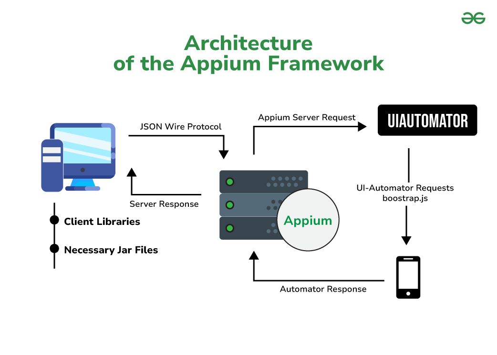

# What is Appium, Setup and Installation

## What is Appium
Appium is an open-source automation tool designed for testing mobile applications (iOS, Android) and some desktop apps. Key points include:

- **Cross-Platform Testing**: Test both iOS and Android apps using the same API
- **No App Modification Required**: Tests the same app users get from app stores
- **Language Flexibility**: Write tests in any WebDriver-compatible language
- **Native, Hybrid & Mobile Web Support**: Tests all types of mobile apps
- **Standard Automation Protocol**: Uses Selenium WebDriver protocol

Benefits include lower learning curve for Selenium users, reusable skills across platforms, integration with popular testing frameworks, CI/CD compatibility, device flexibility, and cloud testing support.

## Appium Architecture

- Appium follows a client-server architecture where a client (test scripts) communicates with a server (Appium) to automate mobile applications. 
- The Appium server, written in Node.js, exposes a REST API. 
- The client interacts with the server through the mobile JSON Wire Protocol, using a session to send commands and receive responses.

References:
- https://www.geeksforgeeks.org/architecture-of-the-appium-framework/

Here's a more detailed breakdown:
1. Client: 
- Test scripts (written in various programming languages) act as the client.
- These scripts send commands to the Appium server.
- Client libraries handle the communication with the server.

2. Server:
- The Appium server is a Node.js-based HTTP server. 
- It receives commands from the client and translates them into actions on the target device. 
- The server interacts with the device's native automation framework (`UIAutomator` for Android, `UIAutomation/XCUITest` for iOS). 

3. Desired Capabilities: 
- Client scripts use Desired Capabilities to specify details about the target device, application, and other settings.
- The server uses this information to identify the appropriate driver and platform for automation.

4. Communication: 
- The communication between client and server uses the mobile JSON Wire Protocol, which is a variation of the JSON Wire Protocol used by Selenium.
- Commands are sent as JSON objects and responses are received in the same format.

5. Drivers: 
- Appium relies on drivers to interact with the device's native automation framework.
- For Android, Appium uses UIAutomator2 (formerly UIAutomator).
- For iOS, Appium uses UIAutomation (before iOS 9.3) or XCUITest (iOS 9.3 and later).

In summary: The client sends commands to the server, which then uses appropriate drivers to interact with the device and execute the commands. The server returns the results back to the client. 