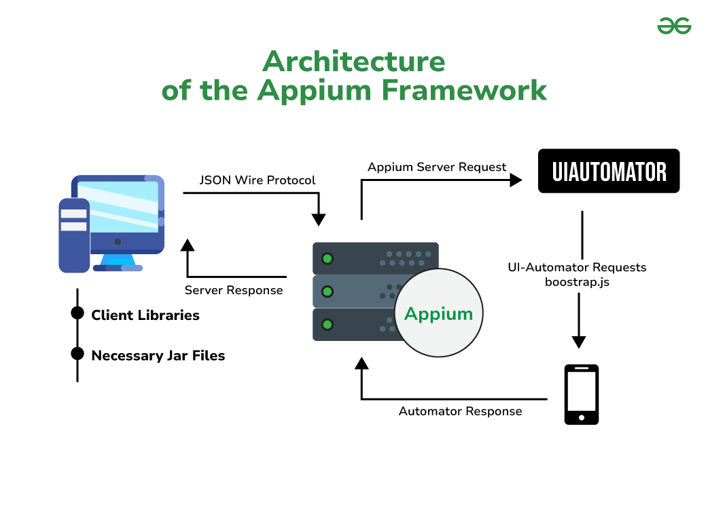

# What is Appium, Setup and Installation

## What is Appium
Appium is an open-source automation tool designed for testing mobile applications (iOS, Android) and some desktop apps. Key points include:

- **Cross-Platform Testing**: Test both iOS and Android apps using the same API
- **No App Modification Required**: Tests the same app users get from app stores
- **Language Flexibility**: Write tests in any WebDriver-compatible language
- **Native, Hybrid & Mobile Web Support**: Tests all types of mobile apps
- **Standard Automation Protocol**: Uses Selenium WebDriver protocol

Benefits include lower learning curve for Selenium users, reusable skills across platforms, integration with popular testing frameworks, CI/CD compatibility, device flexibility, and cloud testing support.

## Appium Architecture

- Appium follows a client-server architecture where a client (test scripts) communicates with a server (Appium) to automate mobile applications. 
- The Appium server, written in Node.js, exposes a REST API. 
- The client interacts with the server through the mobile JSON Wire Protocol, using a session to send commands and receive responses.

References:
- https://www.geeksforgeeks.org/architecture-of-the-appium-framework/

Here's a more detailed breakdown:
1. Client: 
- Test scripts (written in various programming languages) act as the client.
- These scripts send commands to the Appium server.
- Client libraries handle the communication with the server.
2. Server:
- The Appium server is a Node.js-based HTTP server. 
- It receives commands from the client and translates them into actions on the target device. 
- The server interacts with the device's native automation framework (`UIAutomator` for Android, `UIAutomation/XCUITest` for iOS). 
3. Desired Capabilities: 
- Client scripts use Desired Capabilities to specify details about the target device, application, and other settings.
- The server uses this information to identify the appropriate driver and platform for automation.
4. Communication: 
- The communication between client and server uses the mobile JSON Wire Protocol, which is a variation of the JSON Wire Protocol used by Selenium.
- Commands are sent as JSON objects and responses are received in the same format.
5. Drivers: 
- Appium relies on drivers to interact with the device's native automation framework.
- For Android, Appium uses UIAutomator2 (formerly UIAutomator).
- For iOS, Appium uses UIAutomation (before iOS 9.3) or XCUITest (iOS 9.3 and later).

In summary: The client sends commands to the server, which then uses appropriate drivers to interact with the device and execute the commands. The server returns the results back to the client. 

## Setup and Installation
In these steps, we can apply for almost platforms (Windows, MacOSX, Ubuntu, ...)
- Install npm from nodejs
`https://nodejs.org/en/download`
- Install Appium 2.0 official version by running this command
`npm i --location=global appium`
- Appium for Android by running this command
`appium driver install uiautomator2 `
- Appium for ios by running this command
`appium driver install xcuitest@4.12.2`

## Start Appium
### On Windows
we can run this command: `appium ` on your command line.
### On MacOSX
Note check Java version is already installed on your mac:
```
/usr/libexec/java_home -V
```
we should the below steps to ensure all configurations are set up properly.
- Configure `~/.zprofile`. Suggest to use `zprofile` instead of using `~/.bash_profile`
  Open file .zshenv to edit system environment variable
  
```
JAVA_HOME=`/usr/libexec/java_home -v {{java_version}}`
ANDROID_HOME=$HOME/Library/Android/sdk
PATH=$ANDROID_HOME/tools:$PATH
PATH=$ANDROID_HOME/platform-tools:$PATH
PATH=/opt/apache-maven-3.8.6/bin:$PATH
PATH=$GEM_HOME/bin:$PATH
GEM_HOME=$HOME/.gem
PATH=/usr/local/bin/aws-profile:$PATH
PATH=/usr/local/bin/aws-ssm:$PATH
```
- Configurate `~/.bash_profile` properly for Java_Home, Android_Home
```
JAVA_HOME=$(/usr/libexec/java_home -v {{java_version}}
PATH=$JAVA_HOME/bin:$PATH
ANDROID_HOME=$HOME/Library/Android/sdk
ANDROID_SDK_ROOT=$HOME/Android/Sdk
PATH=$ANDROID_HOME/tools/bin:$PATH
PATH=$ANDROID_HOME/tools:$PATH
PATH=$ANDROID_HOME/platform-tools:$PATH
PATH=$ANDROID_HOME/build-tools/{{version}}:$PATH
PATH="${PATH}:$ANDROID_HOME/emulator:$ANDROID_HOME/tools:$ANDROID_HOME/tools/bin:$ANDROID_HOME/platform-tools"
PATH=/usr/local/bin:/usr/bin:/bin:/usr/sbin:/sbin:$PATH
```
- Start Appium with this command: `appium`
- More options: `appium server --allow-insecure chromedriver_autodownload --allow-cors --base-path=/wd/hub` to enable chromedriver for your testing browser view in mobile, allow insecure connection and base path for connections clients.