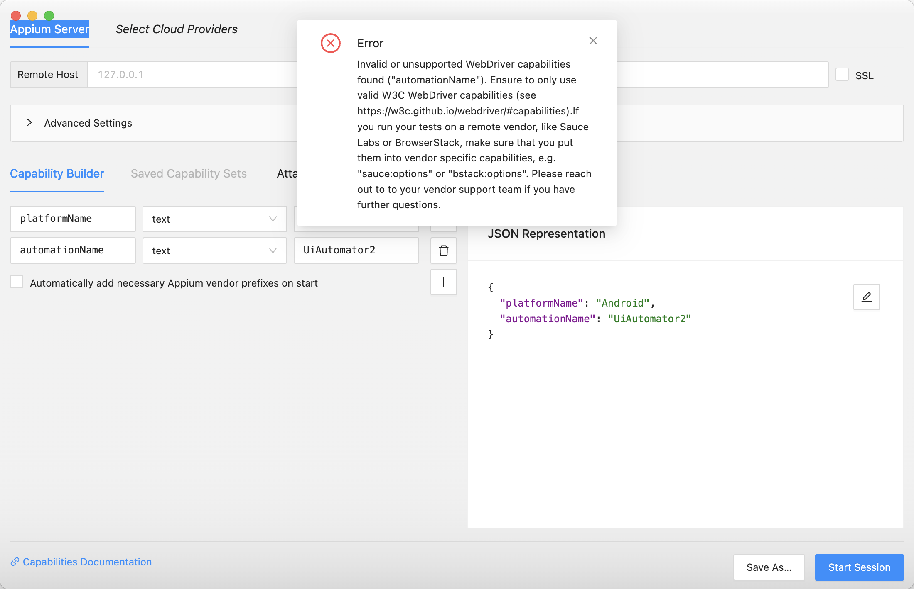
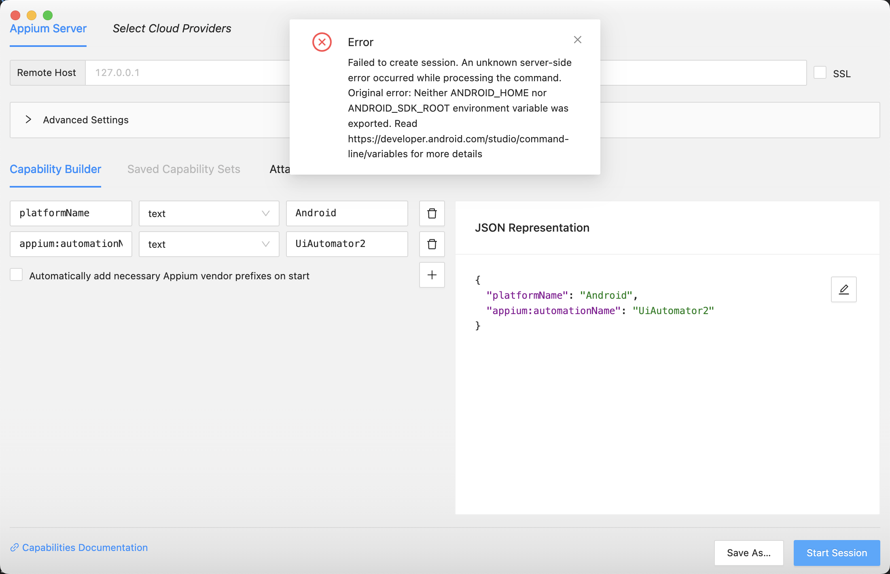

# Configuring Appium Inspector for Android App Locators

## Prerequisites
- Appium Server installed and running
- Android device or emulator connected
- Android app installed on device/emulator
- Appium Inspector installed
- Android SDK and ADB configured

## Step 0: Configure Android SDK and ANDROID_HOME

### For macOS:
1. **Install Android Studio** (if not already installed):
   - Download from [https://developer.android.com/studio](https://developer.android.com/studio)
   - Install Android Studio and Android SDK

2. **Set ANDROID_HOME Environment Variable**:
   ```bash
   # Open your shell profile file
   nano ~/.zshrc  # For zsh (default in macOS Catalina+)
   # OR
   nano ~/.bash_profile  # For bash
   # OR
   nano ~/.zprofile  # For bash
   ```

3. **Add these lines to your profile file**:
   ```bash
   export ANDROID_HOME=$HOME/Library/Android/sdk
   export PATH=$PATH:$ANDROID_HOME/emulator
   export PATH=$PATH:$ANDROID_HOME/tools
   export PATH=$PATH:$ANDROID_HOME/tools/bin
   export PATH=$PATH:$ANDROID_HOME/platform-tools
   ```

4. **Reload your profile**:
   ```bash
   source ~/.zshrc  # For zsh
   # OR
   source ~/.bash_profile  # For bash
   # OR
   source ~/.zprofile
   ```

5. **Verify the configuration**:
   ```bash
   echo $ANDROID_HOME
   adb version
   ```

### For Windows:
1. **Install Android Studio** (if not already installed):
   - Download from [https://developer.android.com/studio](https://developer.android.com/studio)
   - Install Android Studio and Android SDK

2. **Set ANDROID_HOME Environment Variable**:
   - Right-click on "This PC" or "My Computer" → Properties
   - Click "Advanced system settings"
   - Click "Environment Variables"
   - Under "System Variables", click "New"
   - Variable name: `ANDROID_HOME`
   - Variable value: `C:\Users\YourUsername\AppData\Local\Android\Sdk`
   - Click "OK"

3. **Add to PATH Environment Variable**:
   - In the same Environment Variables window
   - Under "System Variables", find "Path" and click "Edit"
   - Click "New" and add these paths:
     ```
     %ANDROID_HOME%\emulator
     %ANDROID_HOME%\tools
     %ANDROID_HOME%\tools\bin
     %ANDROID_HOME%\platform-tools
     ```
   - Click "OK" on all dialogs

4. **Verify the configuration**:
   - Open Command Prompt or PowerShell
   ```cmd
   echo %ANDROID_HOME%
   adb version
   ```

### Common Android SDK Locations:
- **macOS**: `$HOME/Library/Android/sdk`
- **Windows**: `C:\Users\YourUsername\AppData\Local\Android\Sdk`
- **Linux**: `$HOME/Android/Sdk`

### Verify Android SDK Components:
1. **Open Android Studio**
2. **Go to Tools → SDK Manager**
3. **Ensure these components are installed**:
   - Android SDK Platform-Tools
   - Android SDK Build-Tools
   - At least one Android SDK Platform (API level)
   - Android SDK Tools
   - Android Emulator

### Troubleshooting ANDROID_HOME Issues:

#### Issue: "ANDROID_HOME is not set"
**Solution**:
```bash
# macOS/Linux
export ANDROID_HOME=$HOME/Library/Android/sdk
export PATH=$PATH:$ANDROID_HOME/platform-tools

# Windows (Command Prompt)
set ANDROID_HOME=C:\Users\YourUsername\AppData\Local\Android\Sdk
set PATH=%PATH%;%ANDROID_HOME%\platform-tools
```

#### Issue: "adb command not found"
**Solution**:
1. Verify ANDROID_HOME is set correctly
2. Ensure platform-tools is in PATH
3. Restart terminal/command prompt
4. Check if platform-tools directory exists in Android SDK

#### Issue: "Android SDK not found"
**Solution**:
1. Install Android Studio if not installed
2. Open Android Studio → SDK Manager
3. Install required SDK components
4. Note the SDK location and set ANDROID_HOME accordingly

## Step 1: Install UiAutomator2 Driver
1. Open terminal/command prompt
2. Install UiAutomator2 driver using Appium CLI:
   ```bash
   appium driver install uiautomator2
   ```
3. Verify installation:
   ```bash
   appium driver list
   ```
   Example:
   ```
   appium driver list
✔ Listing available drivers
- uiautomator2@4.2.3 [installed (npm)]
- xcuitest [not installed]
- espresso [not installed]
- mac2 [not installed]
- windows [not installed]
- safari [not installed]
- gecko [not installed]
- chromium [not installed]
   ```
4. You should see `uiautomator2` in the list of installed drivers

## Step 2: Start Appium Server
1. Open terminal/command prompt
2. Start Appium server:
   ```bash
   appium
   ```
3. Verify server is running on `http://127.0.0.1:4723`

## Step 3: Prepare Android Device/Emulator
1. Connect your Android device or start emulator
2. Enable USB debugging (for physical device)
3. Verify device is connected:
   ```bash
   adb devices
   ```
4. Install and launch your target app on the device

## Step 4: Launch Appium Inspector
1. Open Appium Inspector
2. Click "New Session" or "Start Session"

## Step 5: Configure Session Capabilities
Fill in the following capabilities in Appium Inspector:

### Required Capabilities:
```json
{
  "platformName": "Android",
  "appium:automationName": "UiAutomator2",
  "deviceName": "Your_Device_Name",
  "appPackage": "com.saucelabs.mydemoapp",
  "appActivity": "com.saucelabs.mydemoapp.MainActivity"
}
```

### Optional Capabilities:
```json
{
  "noReset": true,
  "fullReset": false,
  "newCommandTimeout": 60,
  "autoGrantPermissions": true
}
```
### Error in Capability in Appium Inspector

Please refer to input correct value: [https://appium.io/docs/en/latest/guides/caps/](https://appium.io/docs/en/latest/guides/caps/)

### Error in Appium Inspector - Android SDK configuration


Solution: Follow up the steps in Step 0: Configure Android SDK and ANDROID_HOM

## Step 6: Find App Package and Activity
### Method 1: Using ADB (Recommended)
1. Open terminal and run:
   ```bash
   adb shell dumpsys window | grep -E 'mCurrentFocus|mFocusedApp'
   ```
2. Look for output like:
   ```
   mCurrentFocus=Window{... com.example.app/com.example.app.MainActivity}
   ```

### Method 2: Using Appium Inspector
1. Use "Start Inspector Session" without app details
2. Navigate to your app manually
3. Use "Get Page Source" to find package and activity

### Method 3: Using APK Info
1. Install APK Info app on device
2. Open your app
3. Check the package name and main activity

## Step 7: Start Session
1. Click "Start Session" in Appium Inspector
2. Wait for the session to establish
3. Your app should open on the device
4. Appium Inspector will show the app's UI hierarchy

## Step 8: Inspect Elements
### Basic Inspection:
1. Click on any element in the app
2. Appium Inspector will highlight the element
3. View element details in the right panel:
   - Resource ID
   - Class Name
   - Text
   - Content Description
   - XPath

### Advanced Inspection:
1. Use "Search" feature to find specific elements
2. Use "Tap" to interact with elements
3. Use "Send Keys" to input text
4. Use "Clear" to clear text fields

## Step 9: Generate Locators
### Resource ID (Recommended):
```java
By elementId = By.id("com.example.app:id/button_login");
```

### XPath:
```java
By elementXPath = By.xpath("//android.widget.Button[@text='Login']");
```

### Accessibility ID:
```java
By elementAccessibility = By.accessibilityId("login_button");
```

### Class Name:
```java
By elementClass = By.className("android.widget.Button");
```

### Text:
```java
By elementText = By.xpath("//*[@text='Login']");
```

## Step 10: Test Locators
1. Copy the generated locator
2. Paste in the "Search" field
3. Click "Search" to verify the locator works
4. The element should be highlighted if locator is correct

## Step 11: Save and Export
1. Save your session configuration
2. Export element locators to a file
3. Copy locators to your test code

## Common Locator Strategies

### 1. Resource ID (Most Reliable):
```java
// Preferred method
By loginButton = By.id("com.example.app:id/btn_login");
```

### 2. Accessibility ID:
```java
// Good for accessibility testing
By loginButton = By.accessibilityId("login_button");
```

### 3. XPath with Text:
```java
// When ID is not available
By loginButton = By.xpath("//android.widget.Button[@text='Login']");
```

### 4. XPath with Multiple Attributes:
```java
// More specific locator
By loginButton = By.xpath("//android.widget.Button[@resource-id='com.example.app:id/btn_login' and @text='Login']");
```

## Troubleshooting Common Issues

### 1. Android SDK and ANDROID_HOME Issues:
- **"ANDROID_HOME is not set"**: Follow Step 0 configuration above
- **"adb command not found"**: Verify PATH includes platform-tools
- **"Android SDK not found"**: Install Android Studio and SDK components
- **"SDK location not found"**: Check common locations in Step 0
- **"Permission denied"**: Use `sudo` for macOS/Linux installations

### 2. UiAutomator2 Driver Issues:
- Verify driver is installed: `appium driver list`
- Reinstall if needed: `appium driver uninstall uiautomator2 && appium driver install uiautomator2`
- Check Android SDK installation
- Verify device API level compatibility

### 3. Session Won't Start:
- Verify Appium server is running
- Check device connection
- Verify app package and activity names
- Check Android SDK installation
- Ensure ANDROID_HOME is properly configured

### 4. Elements Not Found:
- Wait for app to fully load
- Check if element is visible
- Try different locator strategies
- Verify element is not in a different context

### 5. Appium Inspector Crashes:
- Restart Appium server
- Clear Appium Inspector cache
- Update Appium to latest version
- Check system resources
- Verify Android SDK installation

### 6. Elements Not Highlighting:
- Ensure app is in foreground
- Check if element is clickable
- Verify element bounds are correct
- Try refreshing the page source

### 7. Device Connection Issues:
- **"No devices found"**: 
  - Enable USB debugging on device
  - Install device drivers (Windows)
  - Run `adb devices` to verify connection
- **"Device unauthorized"**: 
  - Accept USB debugging prompt on device
  - Revoke and re-authorize USB debugging
- **"Device offline"**: 
  - Disconnect and reconnect USB cable
  - Restart ADB: `adb kill-server && adb start-server`

### 8. Appium Inspector Configuration Errors:
- **"Invalid capabilities"**: Check capability format and values
- **"Session creation failed"**: Verify device is connected and app is installed
- **"Driver not found"**: Install UiAutomator2 driver
- **"SDK path not found"**: Set ANDROID_HOME correctly

## Best Practices

### 1. Locator Priority:
1. Resource ID (most stable)
2. Accessibility ID (good for accessibility)
3. XPath with unique attributes
4. Text-based locators (least stable)

### 2. Element Selection:
- Choose elements with unique identifiers
- Avoid dynamic text content
- Use stable attributes
- Consider element hierarchy

### 3. Session Management:
- Keep sessions short
- Restart sessions if app state changes
- Save configurations for reuse
- Document element locators

### 4. Testing Strategy:
- Test locators in different app states
- Verify locators work after app updates
- Use multiple locator strategies as fallbacks
- Document locator changes

## Additional Tips

### 1. Performance Optimization:
- Use resource IDs when possible
- Avoid complex XPath expressions
- Cache frequently used locators
- Minimize element searches

### 2. Maintenance:
- Regularly update element locators
- Monitor app changes
- Keep locator documentation updated
- Version control your locator files

### 3. Debugging:
- Use Appium Inspector's search feature
- Check element properties
- Verify element visibility
- Test locators in isolation

## Resources
- [Appium Inspector Documentation](http://appium.io/docs/en/2.0/tools/inspector/)
- [Android UI Automator Documentation](https://developer.android.com/training/testing/ui-automator)
- [XPath Tutorial](https://www.w3schools.com/xml/xpath_intro.asp)
- [Appium Android Driver Documentation](http://appium.io/docs/en/writing-running-appium/android/android-uiautomator2/)

## Important Notes
- Always test locators in your actual test environment
- Keep locators updated with app changes
- Use descriptive names for your locators
- Document any app-specific locator strategies
- Consider using Page Object Model for better maintainability 