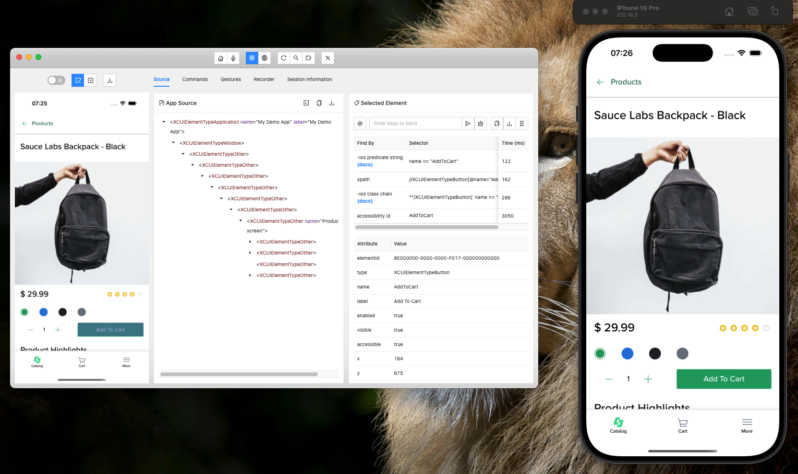
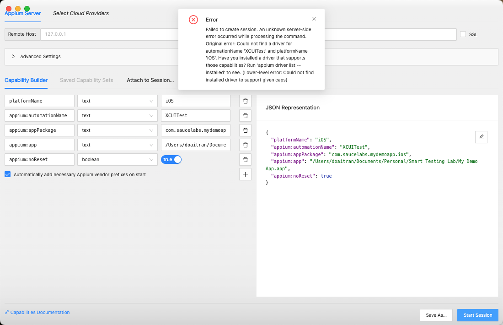
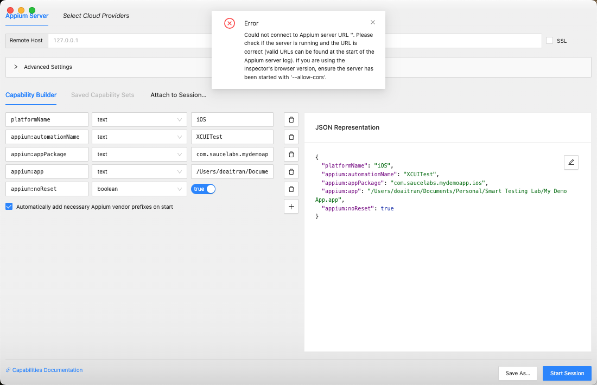
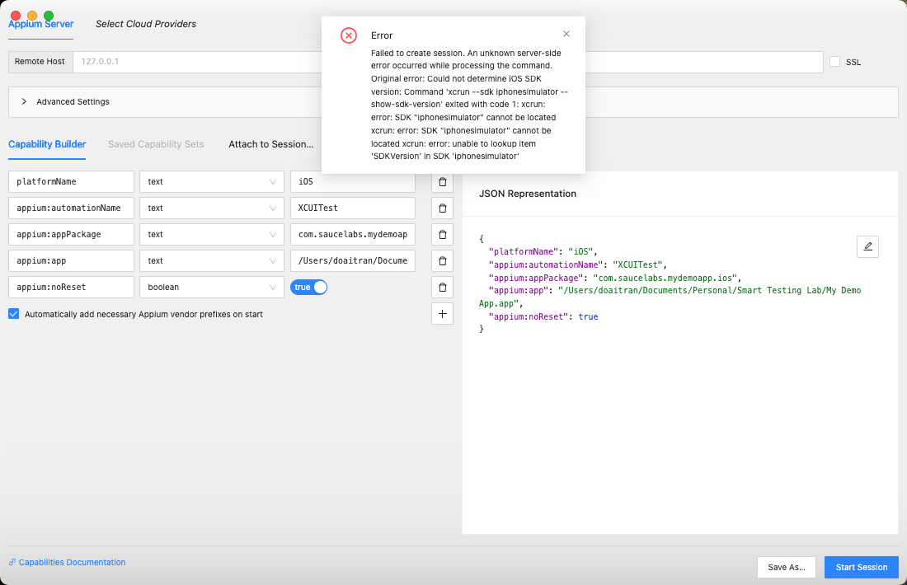
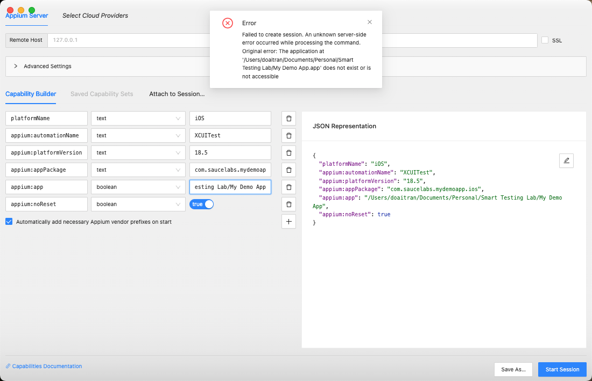

# Steps to setup Appium Server and Appium Inspector
- Install XCUITest Driver
- Start Appium in MacOSX
- Setup Capability to inspect locator

## Command to install XCUITest

```
❯ appium driver list --installed
❯ appium driver install xcuitest
✔ Checking if 'appium-xcuitest-driver' is compatible
✔ Installing 'xcuitest'
ℹ Driver xcuitest@9.9.4 successfully installed
- automationName: XCUITest
- platformNames: ["iOS","tvOS"]
```

After, installed successfully. You expect to receive this result to check you installed successfully or not.

```
appium driver list
   ✔ Listing available drivers
   - uiautomator2@4.2.3 [installed (npm)]
   - xcuitest [installed (npm)]
```
## Configure iOS Simulator SDK
You can run these command:
```
❯ xcode-select --print-path
/Library/Developer/CommandLineTools
❯ xcodebuild -version
xcode-select: error: tool 'xcodebuild' requires Xcode, but active developer directory '/Library/Developer/CommandLineTools' is a command line tools instance
❯ xcrun simctl runtime list
xcrun: error: unable to find utility "simctl", not a developer tool or in PATH
❯ xcode-select --print-path
/Library/Developer/CommandLineTools
❯ xcodebuild -version
xcode-select: error: tool 'xcodebuild' requires Xcode, but active developer directory '/Library/Developer/CommandLineTools' is a command line tools instance
❯ sudo xcode-select --switch /Applications/Xcode.app/Contents/Developer
Password:
❯ sudo xcodebuild -license accept
```

## Start Appium Server
- Open Termninal in your Mac Machine
- Run this command:
```
appium --allow-cors
```

## Setup Capability to inspect locator
Fill in the following capabilities in Appium Inspector:

### Required Capabilities:
```json
{
  "platformName": "iOS",
  "appium:automationName": "XCUITest",
  "appium:appPackage": "com.saucelabs.mydemoapp.ios",
  "appium:app": "/Users/doaitran/Documents/Personal/Smart Testing Lab/My_Demo_App.app",
  "appium:noReset": true
}
```
## General iOS element Locator types

iOS apps use different locator strategies compared to Android. Here are the main locator types available for iOS testing:

### 1. Accessibility ID (Recommended)
Most reliable locator for iOS apps. Uses the `accessibilityIdentifier` property.

```java
// In Java
By elementId = By.accessibilityId("login_button");

// In Appium Inspector
// Locator: accessibility id
// Value: login_button
```

### 2. Class Name
Uses the iOS element class name.

```java
// In Java
By elementClass = By.className("XCUIElementTypeButton");

// In Appium Inspector
// Locator: class name
// Value: XCUIElementTypeButton
```

### 3. Name (Accessibility Label)
Uses the `accessibilityLabel` property of the element.

```java
// In Java
By elementName = By.name("Login");

// In Appium Inspector
// Locator: name
// Value: Login
```

### 4. XPath
Uses XPath expressions to locate elements.

```java
// In Java
By elementXPath = By.xpath("//XCUIElementTypeButton[@name='Login']");

// In Appium Inspector
// Locator: xpath
// Value: //XCUIElementTypeButton[@name='Login']
```

### 5. Predicate String
iOS-specific locator using NSPredicate syntax.

```java
// In Java
By elementPredicate = By.iOSNsPredicateString("type == 'XCUIElementTypeButton' AND name == 'Login'");

// In Appium Inspector
// Locator: -ios predicate string
// Value: type == 'XCUIElementTypeButton' AND name == 'Login'
```

### 6. Class Chain
iOS-specific locator using XCUITest's class chain syntax.

```java
// In Java
By elementClassChain = By.iOSClassChain("**/XCUIElementTypeButton[`name == 'Login'`]");

// In Appium Inspector
// Locator: -ios class chain
// Value: **/XCUIElementTypeButton[`name == 'Login'`]
```

## iOS Element Types

Common iOS element types you'll encounter:

- `XCUIElementTypeButton` - Buttons
- `XCUIElementTypeTextField` - Text input fields
- `XCUIElementTypeStaticText` - Text labels
- `XCUIElementTypeTable` - Tables
- `XCUIElementTypeCell` - Table cells
- `XCUIElementTypeNavigationBar` - Navigation bars
- `XCUIElementTypeTabBar` - Tab bars
- `XCUIElementTypeAlert` - Alert dialogs
- `XCUIElementTypeSwitch` - Toggle switches
- `XCUIElementTypeSlider` - Sliders
- `XCUIElementTypePicker` - Pickers
- `XCUIElementTypeDatePicker` - Date pickers

## Locator Priority for iOS

1. **Accessibility ID** (Most reliable)
2. **Name** (Accessibility Label)
3. **Predicate String** (Flexible and powerful)
4. **Class Chain** (Good for complex hierarchies)
5. **XPath** (Universal but slower)
6. **Class Name** (Least specific)


## iOS-Specific Capabilities

Update your capabilities for iOS testing:

```json
{
  "platformName": "iOS",
  "appium:automationName": "XCUITest",
  "appium:deviceName": "iPhone 14",
  "appium:platformVersion": "17.0",
  "appium:app": "/path/to/your/app.app",
  "appium:noReset": true,
  "appium:autoAcceptAlerts": true,
  "appium:newCommandTimeout": 60,
  "appium:wdaLaunchTimeout": 30,
  "appium:wdaConnectionTimeout": 30
}
```


## Troubleshooting iOS Locators

### Common Issues:

1. **Element not found**:
   - Check if element is visible
   - Verify locator strategy
   - Try different locator types

2. **Element not clickable**:
   - Check if element is enabled
   - Verify element bounds
   - Try tapping center of element

3. **Dynamic content**:
   - Use stable identifiers
   - Avoid text-based locators
   - Consider using accessibility IDs

4. **Performance issues**:
   - Use accessibility IDs when possible
   - Avoid complex XPath expressions
   - Cache frequently used locators

## Error - Missing Appium Driver XCUITest
- If you miss install XCUITest Driver for your Appium Server, you will receive the error as bellow


- Solution: Install Appium XCUITest Driver
```
❯ appium driver install xcuitest
✔ Checking if 'appium-xcuitest-driver' is compatible
✔ Installing 'xcuitest'
ℹ Driver xcuitest@9.9.4 successfully installed
- automationName: XCUITest
- platformNames: ["iOS","tvOS"]
```

## Error - Appium Inspector CORS error
- If you receive the error popup in Appium Inspector related to `--allow cors`

- Please start appium server with this params `--allow cors`
```
appium --allow-cors
```
## Error - Missing  iOS Simulator SDK
- If you don't open your simulator device yet, you will receive the error popup

- You can run these command:
```
❯ xcode-select --print-path
/Library/Developer/CommandLineTools
❯ xcodebuild -version
xcode-select: error: tool 'xcodebuild' requires Xcode, but active developer directory '/Library/Developer/CommandLineTools' is a command line tools instance
❯ xcrun simctl runtime list
xcrun: error: unable to find utility "simctl", not a developer tool or in PATH
❯ xcode-select --print-path
/Library/Developer/CommandLineTools
❯ xcodebuild -version
xcode-select: error: tool 'xcodebuild' requires Xcode, but active developer directory '/Library/Developer/CommandLineTools' is a command line tools instance
❯ sudo xcode-select --switch /Applications/Xcode.app/Contents/Developer
Password:
❯ sudo xcodebuild -license accept
```
- Reset Appium Server

## Error - Wrong iOS Version
- You will receive this error pop-up if input invalid iOS version


## Error - Wrong app location
- You will receive this error pop-up if input wrong app location or inacessible location
